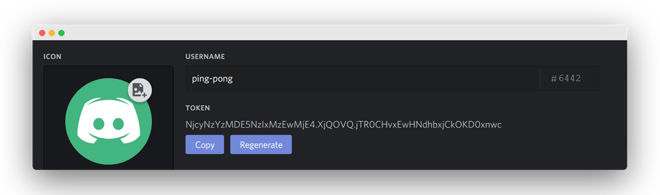

# 📝 How to make a discord-bot
In this article, we are going to be learning how to create a simple discord bot with Node.js. This bot will make send a reply to the command !ping, the reply will be pong. This is a very basic and simple program but it will help you understand how to make a bot and let it reply to messages.

## 👨‍🏫 Prerequisites
* Discord
* Basic knowledge of JavaScript and programming.

## 💾 Setup and Installation
To start things off we're going to be creating a new bot at the [Discord developer portal](https://discordapp.com/login?redirect_to=%2Fdevelopers%2Fapplications%2F). Once there you'll have to click on New Application in the top right corner. This will open up an input field. In this field, here you can fill in the name of your bot. I will put in ping-pong.


Having done that you can now go to the navigation on the left and click on Bot and then Add Bot. A pop up will shop up with the title Add a Bot to this App? and press Yes, do it!. If you did it correctly you should be seeing something like this.


Good job! You have now created a Discord bot but it doesn't do anything yet. Every bot will come with a unique token don't share this with anyone or they will have access to your bot. You can view your token by pressing Click to Reveal Token. We are going to be needing this token when we are programming this bot.



We're now going to be installing two things Node.js and a text editor ( we will be using Visual Studio Code ).

We are going to be starting with installing Node.js. Press the recommended for most users versions and run the installation file. Follow the steps in the installation guide and you'll have successfully downloaded [Node.js + NPM](https://nodejs.org/en/).


For [Visual Studio Code](https://code.visualstudio.com/) it will be the same just press the download for windows or mac button, run the installation file and follow the instructions.


## 👨‍💻 Programming the Bot
Create a folder on your desktop in my case I'm calling it bot. Open up your text editor, in our case, that's Visual Studio Code. In the menu bar on the top, you'll be seeing the file, press that select open folder and browse through your desktop and select the bot folder. Having that opened we must create a file called index.js. Your Visual Studio Code should look like this. 


Great select the index.js because in that we are going to write some code that will store our bot token from earlier in a variable. Just copy your own token and place replace mine with it.
```javascript
const TOKEN = 'NjcyNzYzMDE5NzIxMzEwMjE4.XjQOVQ.jTR0CHvxEwHNdhbxjCkOKD0xnwc';
```
Now press **ctrl+\`** or **cmd+\`** for mac this will bring up the terminal in that just type the following command in the terminal and press enter.
```
npm init -y
```
After that we will install the discord package by typing the following command in our terminal and pressing enter.
```
npm install discord.js --save
```
Your folder structure should now look like this.


Now in the index.js, we are going to import discord.js and create a variable called bot and store the discord.client in that. Next we're going to make the bot login and your code should now look like this.
```javascript
const TOKEN = 'NjcyNzYzMDE5NzIxMzEwMjE4.XjQOVQ.jTR0CHvxEwHNdhbxjCkOKD0xnwc';

const Discord = require('discord.js');
const bot = new Discord.Client();

bot.login(TOKEN);
```
Next up we're going to program the functionality of this bot. What we want the bot to do is whenever we write !ping in the chat the bot should reply with pong. So we are going to check whenever a message is a the content of the message and seeing if it is equal to !ping. When it is equal we are going to reply with pong.
```javascript
const TOKEN = 'NjcyNzYzMDE5NzIxMzEwMjE4.XjQOVQ.jTR0CHvxEwHNdhbxjCkOKD0xnwc';

const Discord = require('discord.js');
const bot = new Discord.Client();

bot.login(TOKEN);

bot.on('message', msg => {
    if (msg.content === "!ping") {
        msg.reply("pong")
    }
});
```
You can run this bot by typing the following command in the terminal.
```
node .
```
It won't be doing anything because we haven't invited the bot to any server yet.
## 🏡 Inviting the bot
Firstly we need to get the Bot id which is in the general information.


We are going to go to [this site](https://discordapi.com/permissions.html#3072) and giving the bot permission to read messages and send messages and enter the client id in below.


Click on the link below the page and select what channel you want your bot to go in then click on authorize and you should see it appear in the Discord channel.
## ✅ Finished
Go into Visual Studio Code and type in the terminal the following:
```
node .
```
The bot should now be online and working.


Congratulations you have now made your very first Discord bot!
